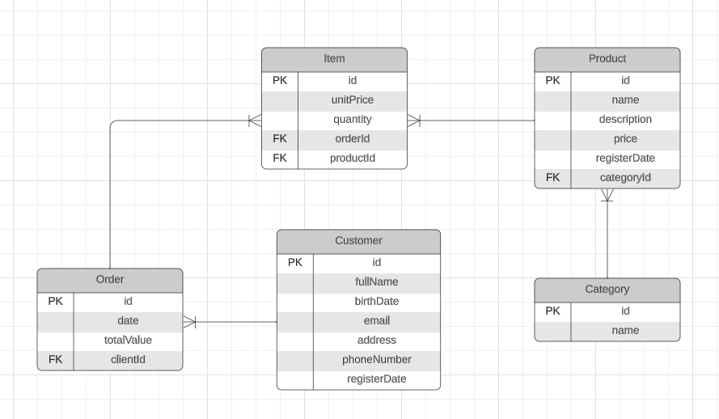

# Web Shop RESTful API

**An API designed for a Web Shop System**

A project built from scratch that incorporates various technologies essential to Java's back-end environment. I can provide detailed explanations for the decisions made in this project.

**Goal:** the aim of this project is to demonstrate my technical skills and to serve as a robust example of a REST API that can be referenced for building enterprise-level applications.

**Technologies:** Java 17, Spring Boot, Spring Security (JWT), REST API, PostgreSQL, Lombok, MVC Pattern, Maven, Git, GitHub, Docker, Docker Compose, Linux, Amazon Web Services (EC2), Javadoc, and Swagger.

## Testing the Deployed API

**AWS EC2 Instance Public IP:** *18.228.138.85*

**Swagger:** http://18.228.138.85:8080/swagger-ui/index.html